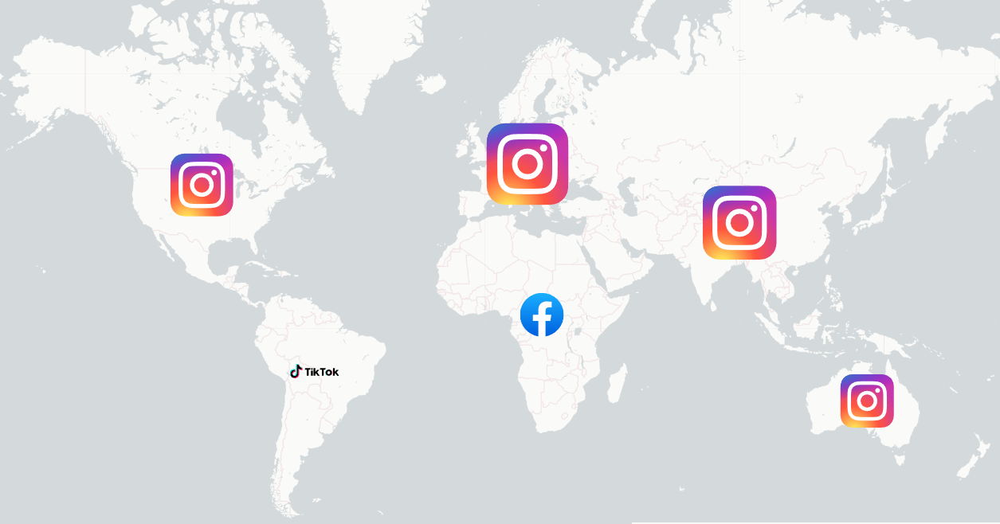
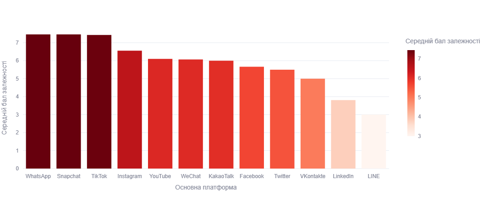

# 📊 Students' Social Media Addiction Analysis

[](https://streamlit.io/)
[](https://www.python.org/)
[](https://www.kaggle.com/)

Інтерактивний дашборд для аналізу впливу соціальних мереж на життя студентів (16–25 років).  
Проект досліджує взаємозв'язок між цифровими звичками, ментальним здоров'ям та соціальними стосунками на основі даних з **6 континентів**.

---
## 🔍 Гіпотези для перевірки

1.  **Гіпотеза 1 (Здоров'я):** Існує сильна негативна кореляція між часом у соцмережах та кількістю годин сну.
2.  **Гіпотеза 2 (Психіка):** Студенти з вищим показником `Addicted_Score` мають нижчий рівень психічного здоров'я.
3.  **Гіпотеза 3 (Платформи):** Платформи з алгоритмічною стрічкою (TikTok, Instagram) викликають вищий рівень залежності.
4.  **Гіпотеза 4 (Стосунки):** Статус "Complicated" корелює з найвищою частотою конфліктів через соціальні медіа.
5.  **Гіпотеза 5 (Соціальний захист):** Стабільні стосунки ("In Relationship") діють як захисний фактор, знижуючи середній рівень залежності.
6.  **Гіпотеза 6 (Навчання):** Високий рівень залежності (`Addicted_Score` > 7) у 100% випадків негативно впливає на самооцінку успішності.
7.  **Гіпотеза 7 (Географія):** Регіони з високим рівнем цифровізації (Північна Америка) мають вищий рівень залежності порівняно з Європою.

---


## 🚀 Live Demo
👉 [Дивитися на Streamlit Cloud](https://social-media-addiction-final.streamlit.app/)

---

## 🌟 Ключові можливості
- 🌍 **Глобальна аналітика**: Інтерактивна карта світу (Folium) з регіональними лідерами платформ.  
- 📑 **Перевірка гіпотез**: Візуалізація впливу соцмереж на сон, навчання та конфлікти в сім'ї.  
- 🤖 **ML-Діагностика**: 3D-кластеризація користувачів (K-Means) на три сегменти: *Збалансовані*, *Група ризику*, *Залежні*.  
- 🧩 **Self-Test**: Інтерактивна форма для визначення власного цифрового профілю.  

---

## 🛠 Технологічний стек
- **Data Processing**: Python, Pandas, NumPy  
- **Visualizations**: Plotly, Folium, Seaborn  
- **Machine Learning**: Scikit-learn (K-Means Clustering)  
- **Web Framework**: Streamlit  

---

## 🔍 Головні інсайти
- 📸 **Гегемонія Instagram**: Платформа є лідером у 4 з 6 регіонів.


 
- 🎵 **Алгоритмічна пастка**: Користувачі TikTok та Instagram мають найвищу залежність.


   
- 😴 **Дефіцит сну**: Зростання часу у соцмережах безпосередньо веде до скорочення тривалості сну.  

---

## 📂 Структура репозиторію

```text
students-social-media-addiction/
├── data/
│   ├── raw/                # Вихідний набір даних (Students Social Media Addiction.csv)
│   └── processed/          # Очищений та збагачений набір (cleaned_data.csv)
│
├── notebooks/              # Покрокове дослідження в DataLab
│   └── full_analysis.ipynb
│
├── app/
│   └── streamlit_app.py     # Основний код інтерактивного додатка
│
├── visuals/                # Статичні графіки для звіту та документації
│   ├──  
│   └──
│
├── requirements.txt        # Перелік залежностей для середовища Streamlit
├── README.md               # Презентація проєкту
├── PROJECT_PLAN.md         # Дорожня карта (початковий план роботи)
└── STORYTELLING.md         # Повний аналіз проекту
```

---

## 🚀 Як запустити локально

### 1. Клонуйте репозиторій
```bash
git clone https://github.com/vitalii-84/Social-Media-Addiction.git
```

### 2. Встановіть залежності
```bash
pip install -r requirements.txt
```

### 3. Запустіть додаток
```bash
streamlit run app/streamlit_app.py
```

---

## 📊 Джерело даних
[Kaggle: Social Media Addiction Dataset](https://www.kaggle.com/datasets/adilshamim8/social-media-addiction-vs-relationships)

---
## 📖 [Читати повний аналіз тут](STORYTELLING.md)
---

## [Jupyter notebook](https://www.datacamp.com/datalab/w/596a2147-bd98-4873-aeda-bb0d35e2f16c/edit)

